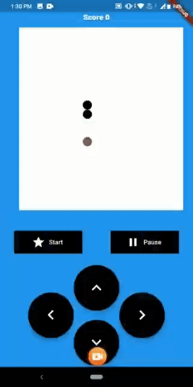
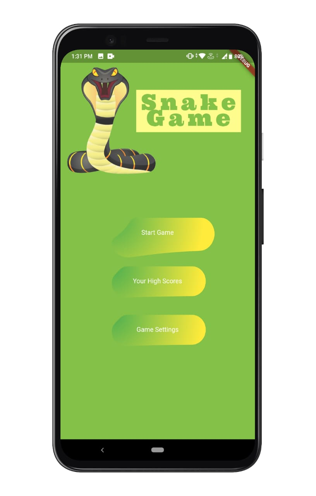
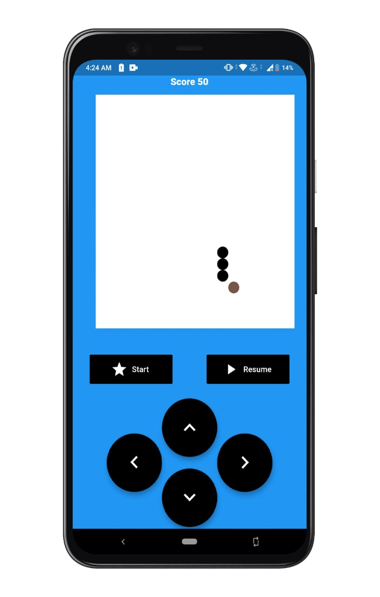
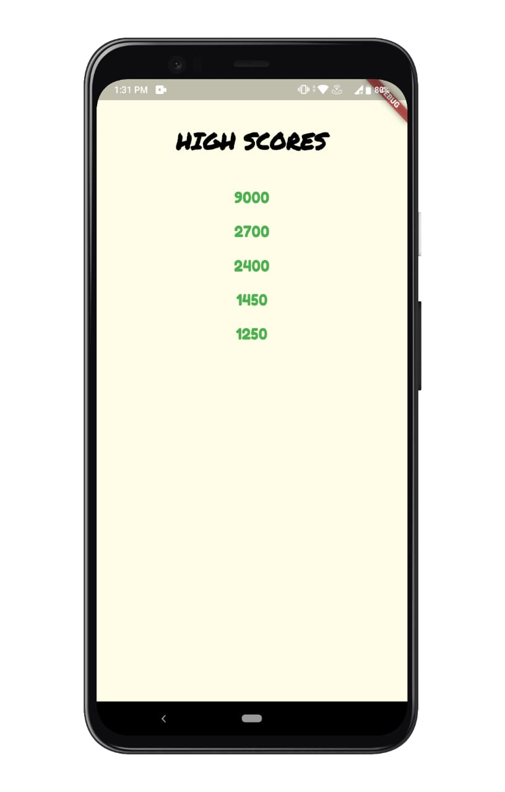
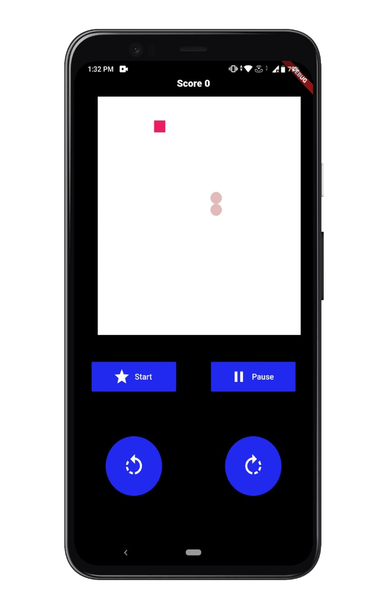
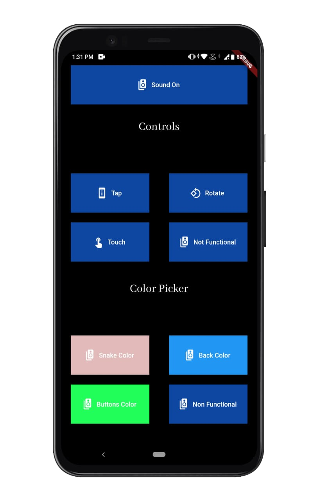

 

## Snake Game
A snake Game Made with Flutter

### Description
This is a small project made in flutter
currently it has fully customized colors
and 3 control modes

### Control Modes
* Tap on Buttons and Play(Default Mode)
* Touch Screen Mode
* Tap and Rotate

## Demo

## Images
</img>&nbsp;
</img>&nbsp;
</img>&nbsp;
 
</img>&nbsp;
</img>&nbsp;
</img>&nbsp;

## Contribute
Feel free to contribute and add various customizations    
Do star the repository if You liked the project

